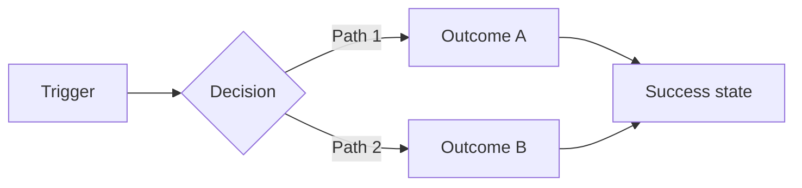

## 解決什麼問題

沒有 PRD，工程師會用自己的 假設寫程式、設計師用自己的 假設畫稿、QA 用自己的 假設寫 case。
三邊各跑各的，第二週才發現對不上，全部重做。
PRD 不是文件儀式，是**讓 PM、UX、Architect、Dev、QA 在開工前對齊「為何做、做什麼、不做什麼」的決策中樞**。

## 誰負責、和誰對接

- **主責：** PM（最終簽核 scope 與 KPI）
- **協作：** UX（驗證需求）、Architect（評估技術可行性）、BA（補規則細節）
- **下游收件：** PO 寫 backlog、Dev Lead 切任務、QA 寫 test plan、UX 畫 flow

## 何時用、何時不用

- ✅ **必要時機：** 跨團隊新功能、影響 ≥ 2 個系統元件、需求穩定度 < 60%
- ❌ **不需要時：** Bug fix、單一團隊內 < 3 人協作、技術探索 spike
- ⚠️ **常見誤用：** 把 PRD 當設計稿寫（要寫 what & why，不寫 how）；把 PRD 當合約鎖死（應是 baseline + change policy）

## AI 怎麼加速

把 discovery 階段素材整份丟給 agent，讓 agent 讀範本內的 `> [!IMPORTANT]` 規則與 `<!-- ai-fill -->` 註解自己填，**人工只審 trade-off**。本卡輸出**真實 PRD markdown 文件**（對標 Linear / Atlassian / GitHub Spec Kit），含表格、Mermaid、inline `[H/M/L]` confidence badge，**不出 YAML schema**。

## 文件範本

下面兩個 tab 是同一份契約的兩種版本，AI 讀同一份範本可雙模式輸出：**輕量範本** 給 solo / MVP / spike 用，**完整範本** 給跨職能團隊 / production / 合規場景用。範本內所有 `> [!IMPORTANT]` 是 AI 章節級規則、`<!-- ai-fill / ai-rule -->` 是欄位級微指引、結尾 `> [!CAUTION]` 是輸出前自檢清單。

```template-light
---
doc_type: "prd"
variant: "light"
status: "draft"
owner: "<your-name>"
last_updated: "YYYY-MM-DD"
upstream:
  required: ["project-brief", "jtbd"]
  optional: ["value-hypothesis"]
---

# Product Requirements: <product-name>

**Status:** Draft v0.X · **Owner:** <name> · **Last updated:** YYYY-MM-DD

> [!IMPORTANT]
> **AI 填寫規則：** 本範本 7 段（編號 1, 2, 5, 6, 9, 10, 12），全部必填——刻意沿用完整版的章節編號讓兩版可對照。每結論行內加 `（依據：brief §XXX / JTBD-NNN）`；每量化欄位加 `[H]/[M]/[L]` confidence badge；缺資料寫 `_TODO: 需要 XXX_` 不編造；不寫 how。

---

## 1. Executive Summary

<!-- ai-fill: 3-5 行，主管 30 秒讀完。只寫「解什麼問題、給誰、預期影響」，不寫實作 -->

<3-5 行說明>

> **TL;DR:** <一句話總結>

---

## 2. Goals & Non-Goals

### Goals

<!-- ai-rule: 1-3 個 Goal + 必填 Counter-metric 行（防 goal-hacking） -->

| # | Goal | Why this matters | Success metric | Confidence |
|---|---|---|---|---|
| G1 | <具體目標> | <業務影響> | <可量測門檻> | **[H]** |
| **Counter** | <反指標> | <防止為衝 G1 而破壞的東西> | <門檻> | **[H]** |

### Non-Goals

- ❌ **Not solving:** <X> — Rationale: <為何不在 scope，屬哪張卡>

---

## 5. Functional Requirements

<!-- ai-rule: 輕量版只列 P0，3-5 個為宜。P0 必須對應上游 value-hypothesis.riskiest_assumption -->

### FR-1: <name> · Priority **P0** · **[H]**

- **Statement:** <做什麼，不寫怎麼做>
- **Acceptance:**
  - Given <前置條件>
  - When <使用者動作>
  - Then <系統預期行為>
- **Source:** brief §待解痛點 + JTBD-001

### FR-2: ...

---

## 6. NFR

<!-- ai-rule: 輕量版至少 2 象限（latency 必填 + 1 個 critical）。不適用的象限直接省略 -->

| Dimension | Target | Rationale | Confidence |
|---|---|---|---|
| **Latency** | p95 < Xs | <對應 JTBD success_criteria> | **[H]** |
| **<critical 2nd>** | <target> | <rationale> | **[H]** |

---

## 9. Risks（top 3）

<!-- ai-rule: 只列 top 3，每條含「失效模式 + Mitigation + Owner」三件 -->

> **R1:** <風險描述> — **Mitigation:** <如何降低> — **Owner:** <誰負責>
>
> **R2:** ...
>
> **R3:** ...

---

## 10. Decision Log（key 2-3 條）

<!-- ai-rule: 每條必含 chosen + 至少 1 個 rejected + 拒絕原因 -->

| Date | Decision | Options | Chosen | Rejected why | Confidence |
|---|---|---|---|---|---|
| YYYY-MM-DD | <決策題目> | A / B | A | B (成本 > 收益) | **[H]** |

---

## 12. Confidence & Sources & TODO

- **整份文件最低 confidence 欄位：** <列出所有 [L] 與 [M]>
- **Fabricated assumptions（推測但 input 未明說）：**
  - <假設 1>
- **Highest-value next input:** <下一份最該補的訪談 / 資料類型>

### TODO（缺資料）

- _TODO: 需要 XXX 校準 G1 baseline_

---

> [!CAUTION]
> **輸出前 AI 自檢：**
> - [ ] 7 段 H2 章節齊全（編號 1, 2, 5, 6, 9, 10, 12，刻意不連號）
> - [ ] 每個 FR / Goal / NFR 帶 inline `[H/M/L]` badge
> - [ ] Goals 表含 `**Counter**` 行
> - [ ] Decision Log ≥ 1 條，每條有 rejected reason
> - [ ] NFR 至少 2 象限（latency 必填）
> - [ ] 無 YAML / JSON schema 輸出（PRD 是給人讀的 markdown）
```

````template-full
---
doc_type: "prd"
variant: "full"
status: "draft"
owner: "<your-name>"
last_updated: "YYYY-MM-DD"
upstream:
  required: ["project-brief", "jtbd", "value-hypothesis"]
  optional: ["journey-map", "competitive-scan"]
---

# Product Requirements: <product-name>

**Status:** Draft v0.X · **Owner:** <PM name> · **Last updated:** YYYY-MM-DD · **Reviewers:** UX / Architect / QA

> [!IMPORTANT]
> **AI 填寫規則：** 12 段 H2 章節全部必填（任一缺失即不合格）。對標 Linear / Amplitude / Atlassian / GitHub Spec Kit。每結論行內 `（依據：brief §XXX / JTBD-NNN / value-hypothesis §riskiest）`；每量化欄位 `[H/M/L]` badge；缺資料寫 `_TODO: 需要 XXX_` 不編造；只寫 what & why 不寫 how（實作屬 ADR-NNN / api-spec 卡）；禁 YAML/JSON schema 輸出。

---

## 1. Executive Summary
<!-- owner: PM · required: always -->

<!-- ai-fill: 3-5 行，主管 30 秒讀完 -->

<3-5 行說明：要解什麼問題、目標族群、預期影響>

> **TL;DR:** <一句話總結>

---

## 2. Goals & Non-Goals
<!-- owner: PM · required: always -->

### Goals

<!-- ai-rule: 3-5 個 Goal + 必填 Counter-metric 行。Counter 必須對應一個 JTBD 互斥（防 goal-hacking） -->

| # | Goal | Why this matters | Success metric | Confidence |
|---|---|---|---|---|
| G1 | <具體目標> | <業務影響> | <可量測門檻> | **[H]** |
| G2 | ... | ... | ... | **[M]** |
| **Counter** | <反指標目標> | <防止為衝 G1 而破壞> | <門檻> | **[H]** |

### Non-Goals

- ❌ **Not solving:** <X> — Rationale: <理由 + 屬哪張卡>
- ❌ **Not solving:** <Y> — Rationale: ...

---

## 3. Users & Scenarios
<!-- owner: PM + UX · required: full-only · skippable: 無 UX 角色時可降為 1 段純 personas -->

**Primary persona:** <對應 JTBD-001>
**Secondary persona:** <對應 JTBD-002>

### Key scenarios

1. <情境 1：when X, user does Y, gets Z>
2. <情境 2>
3. <情境 3>

### Edge cases

- <極端 input>
- <第三方 API 失敗>
- <網路中斷時的行為>

---

## 4. User Flow
<!-- owner: UX · required: full-only · skippable: 無 UX 角色時可改 ASCII flow -->

> [!IMPORTANT]
> **AI 填寫規則：** 用 mermaid `flowchart TD` 或 `flowchart LR` 畫主流程，節點數 5-9 個。若上游 journey-map 文件存在，flow 必須對齊；不存在時依 JTBD 推導並標 `_推導自 JTBD-XXX_`。



---

## 5. Functional Requirements
<!-- owner: PM + Dev · required: always -->

<!-- ai-rule: P0/P1/P2 切分必須對應上游 value-hypothesis.riskiest_assumption — P0 必須足以驗證 riskiest -->

### FR-1: <name> · Priority **P0** · **[H]**

- **Statement:** <做什麼，不寫怎麼做>
- **Acceptance:**
  - Given <前置條件>
  - When <使用者動作>
  - Then <系統預期行為>
- **Source:** brief §待解痛點 + JTBD-001.functional_job
- **Notes:** <實作屬 ADR-001>

### FR-2: <name> · Priority **P0** · **[H]**

...

### FR-3: <name> · Priority **P1** · **[M]**

...

---

## 6. Non-Functional Requirements
<!-- owner: Architect + UX(a11y) · required: always -->

<!-- ai-rule: 4 象限全填（latency / a11y / security / audit）。任一象限不適用須在 Rationale 寫明為何不適用，不能直接砍 -->

| Dimension | Target | Rationale | Confidence |
|---|---|---|---|
| **Latency** | p95 < Xs / p99 < Ys | <對應 JTBD success_criteria> | **[H]** |
| **A11y** | WCAG 2.2 AA | <為何不 AAA / 不 A> | **[H]** |
| **Security** | Data class · Threat model | <無 PII 因此不適用 PCI-DSS> | **[M]** |
| **Audit** | Log retention · PII policy | <Plausible / GA4 預設> | **[H]** |

---

## 7. Integration & Dependencies
<!-- owner: Architect · required: full-only -->

<!-- ai-rule: 至少含 1 條 upstream + 1 條 downstream。Failure mode 必填 -->

| System | Direction | Contract | Failure mode | Owner |
|---|---|---|---|---|
| <upstream API> | inbound | REST / GraphQL | <if down> | <team> |
| <downstream service> | outbound | ... | ... | ... |

---

## 8. Acceptance Test Strategy
<!-- owner: QA · required: full-only -->

<!-- ai-rule: 對應每個 FR 至少 1 條測試類型；總表必須覆蓋 unit / integration / e2e 三層至少各 1 -->

| FR | Test type | Tool | Pass criteria |
|---|---|---|---|
| FR-1 | e2e | Playwright | <criteria> |
| FR-2 | integration | Vitest | ... |
| FR-3 | unit | Vitest | ... |

---

## 9. Risks & Open Questions
<!-- owner: All · required: always -->

### Risks

<!-- ai-rule: 每條格式：失效模式 + Mitigation + Owner 三件齊 -->

> **R1:** <失效模式> — **Mitigation:** <如何降低> — **Owner:** <誰負責>
>
> **R2:** ...

### Open Questions

- [ ] **Q1:** <尚未解的問題，需誰回答>
- [ ] **Q2:** ...

---

## 10. Decision Log
<!-- owner: PM · required: always -->

<!-- ai-rule: 每條必含 ≥ 2 個 rejected options + 各自 rejected reason，否則不算 audit-ready -->

| Date | Decision | Options considered | Chosen | Rejected why | Confidence |
|---|---|---|---|---|---|
| YYYY-MM-DD | <決策題目> | A / B / C | A | B (成本 > 收益)、C (out of scope，屬 V1) | **[H]** |

---

## 11. Out of Scope
<!-- owner: PM · required: full-only -->

本 PRD **不處理**：

- ❌ **不畫 UI mockup / 設計稿** — 屬 high-fidelity-mockup 卡
- ❌ **不出具 API spec 或 DB schema** — 屬 ADR / api-spec / data-model 卡
- ❌ **不寫 sprint 拆解或時程估算** — 屬 PO / backlog 工作
- ❌ **不定義 KPI 公式細節** — 屬 okr 卡

---

## 12. Confidence & Sources & TODO
<!-- owner: All · required: always -->

- **整份文件最低 confidence 欄位：** <列出所有 [L] 與 [M] 欄位>
- **Fabricated assumptions（推測但 input 未明說的）：**
  - <假設 1>
  - <假設 2>
- **Highest-value next input:** <下一份最該補的訪談 / 資料類型>

### TODO（缺資料）

- _TODO: 需要 8-20 份 switch interview 校準 G1 success metric baseline_
- _TODO: 需要競品 funnel benchmark 驗證 G2_

---

> [!CAUTION]
> **輸出前 AI 自檢：**
> - [ ] 12 段 H2 章節齊全（編號 1-12）
> - [ ] 每個 FR / Goal / NFR 帶 inline `[H/M/L]` badge
> - [ ] Goals 表含 `**Counter**` 行
> - [ ] NFR 4 象限全填（不適用須在 Rationale 寫明）
> - [ ] User Flow 段含 mermaid（無 UX 時 ASCII flow + JTBD 推導標記）
> - [ ] Integration & Dependencies 至少 1 upstream + 1 downstream
> - [ ] Acceptance Test Strategy 覆蓋 unit/integration/e2e 至少各 1
> - [ ] Decision Log 每條 ≥ 2 個 rejected options + 各自 reason
> - [ ] Risks 每條格式：失效模式 + Mitigation + Owner
> - [ ] 無 YAML / JSON schema 輸出（PRD 是給人讀的 markdown）
````

## 怎麼觸發

先在上方 tab 選「輕量範本」或「完整範本」、按複製存到你的 AI 工作環境（web chat 對話框、Claude Code / Cursor / Aider 等 harness agent 的 context、或專案內任何 markdown 檔），再複製下面這段、把貼位區換成你的真實文件全文，給 AI：

```trigger
請依據以下「文件範本」與「上游文件」產出 PRD markdown。嚴格遵守範本內所有 `> [!IMPORTANT]` 規則、`<!-- ai-fill -->` / `<!-- ai-rule -->` 欄位指引，並在結尾跑完 `> [!CAUTION]` 自檢清單。

## 文件範本（貼這裡）
⏬
（貼上面選好的「輕量範本」或「完整範本」全文）
⏫

## 上游文件（貼這裡）
⏬
（貼 project-brief.md / jtbd.md / value-hypothesis.md 全文）
⏫
```

> [!TIP]
> **常見錯誤：** 把 PRD 當設計稿寫（要寫 what & why 不寫 how）、P0 沒對應 riskiest assumption、Decision Log 只列 chosen 不列 rejected（= 黑箱）、NFR 砍 a11y / security 象限沒寫 Rationale。AI 若漏這些，自檢清單會抓到並回頭補。
