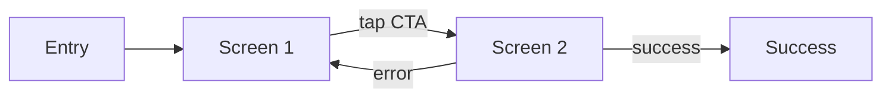
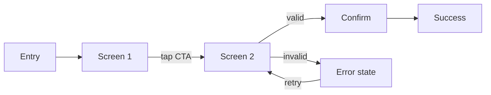

## 解決什麼問題

PRD 上看起來合理的流程，使用者實際操作可能完全迷失。
Prototype 用 Figma/Framer 串起 wireframe，讓**真實使用者能點、能滑、能感受**，找出靜態圖看不見的問題。
不做 prototype 就直接 build，等於把 usability test 延到上線後。

## 誰負責、和誰對接

- **主責：** UX（行為設計）/ UI（視覺呈現）
- **協作：** PM（驗證需求）、Dev（評估技術限制）
- **下游收件：** UX 跑 usability test、UI 做 high-fidelity、Dev 估開發成本

## 何時用、何時不用

- ✅ **必要時機：** 高風險互動（金流、註冊、首次體驗）、新手勢/動畫、stakeholder 對 flow 有歧見
- ❌ **不需要時：** 既有元件複用、純內容頁、簡單表單
- ⚠️ **常見誤用：** 做得過度精細變成「demo 用」而非「測試用」；prototype 應**夠真實到能測試，但不浪費資源做最終視覺**

## AI 怎麼加速

把 wireframe + user flow + 受測者 segment 整份丟給 agent，讓 agent 讀範本內 `> [!IMPORTANT]` 規則與 `<!-- ai-fill -->` 註解自己填，**人工只審任務真實性與引導風險**。本卡輸出**真實 prototype plan markdown**（含 flow 步驟、互動 spec、測試題目表、inline `[H/M/L]` confidence badge），**不出 YAML schema**。

## 文件範本

下面兩個 tab 是同一份 prototype 契約的兩種版本：**輕量範本** 給單一 flow、3 個受測任務以內的 quick check，**完整範本** 給高風險互動（金流 / 註冊）+ 5 受測者 think-aloud + a11y audit 場景。範本內所有 `> [!IMPORTANT]` 是 AI 章節級規則、`<!-- ai-fill / ai-rule -->` 是欄位級微指引、結尾 `> [!CAUTION]` 是輸出前自檢清單。

````template-light
---
doc_type: "prototype"
variant: "light"
status: "draft"
owner: "<your-name>"
last_updated: "YYYY-MM-DD"
upstream:
  required: ["wireframe", "user-flow"]
  optional: ["recruit-criteria"]
---

# Prototype Plan: <product-name>

**Status:** Draft v0.X · **Owner:** <UX name> · **Last updated:** YYYY-MM-DD

> [!IMPORTANT]
> **AI 填寫規則：** 本範本 6 段（編號 1, 2, 3, 6, 10, 12），全部必填——刻意沿用完整版章節編號讓兩版可對照。Fidelity 必為 low / mid（不浪費資源做 high）；測試任務必為 task-based（給目標、不告訴怎麼做）；嚴禁引導性語句（「這裡是不是很簡單？」= 直接 reject）；每結論行內 `（依據：wireframe §XXX / flow §YY）`；量化欄位 `[H/M/L]` badge；缺資料寫 `_TODO_` 不編造受測者 quote。

---

## 1. Executive Summary

<!-- ai-fill: 3-5 行：受測 flow、fidelity 等級、預計受測人數、最大未驗證假設 -->

<3-5 行說明>

> **TL;DR:** <一句話：本 prototype 要在 build 前驗證什麼互動>

---

## 2. Flow Steps

> [!IMPORTANT]
> **AI 填寫規則：** 用 mermaid `flowchart LR` 畫 prototype 涵蓋的主流程；節點 5-9 個；包含 ≥ 1 個 edge state 分支。



### Step table

| Step | Screen | User goal | Expected action | Next | Confidence |
|---|---|---|---|---|---|
| 1 | S1 | <一句目標> | tap primary CTA | S2 | **[H]** |
| 2 | S2 | <一句目標> | 填表單 + submit | S3 | **[H]** |

---

## 3. Edge State Coverage

<!-- ai-rule: 至少涵蓋 3 種 edge state（loading / empty / error 必有 1）；每條含 trigger + recovery path -->

| State | Screen | Trigger | Recovery path |
|---|---|---|---|
| loading | S2 | submit 後等待 < 2s | 顯示 spinner + 禁用 CTA |
| error | S2 | API 失敗 / 表單錯誤 | inline error + retry |
| empty | S3 | 無歷史資料 | empty illustration + CTA |

---

## 6. Test Questions（task-based）

<!-- ai-rule: 每題 task-based 情境（不告訴怎麼做）+ success criteria + ≥ 3 個 observation checkpoint；嚴禁引導語 -->

### T1: <情境名稱>

- **Scenario:** 「<例：你剛收到訂單，請取消上個月的訂閱。>」
- **Success criteria:** time ≤ 60s · clicks ≤ 4 · errors ≤ 1
- **Observation checkpoints:**
  - <可能卡住的點 1>
  - <可能卡住的點 2>
  - <可能卡住的點 3>
- **Leading-language check:** ✅ 已自審無引導語
- **Source:** wireframe §S2

### T2: ...

---

## 10. Decision Log（key 2-3 條）

<!-- ai-rule: 每條必含 chosen + 至少 1 個 rejected + 拒絕原因 -->

| Date | Decision | Options | Chosen | Rejected why | Confidence |
|---|---|---|---|---|---|
| YYYY-MM-DD | Fidelity 等級 | low / mid / high | mid | low (測不出 micro)、high (受測者視覺分心) | **[H]** |

---

## 12. Confidence & Sources & TODO

- **整份文件最低 confidence 欄位：** <列出所有 [L] 與 [M]>
- **Fabricated assumptions：**
  - <例：假設受測者裝置為 mobile + 有網路>
- **Highest-value next input:** <例：技術 spike 結果 / 競品 prototype 對標>

### Known limitations

- <例：iOS 手勢無法在 web prototype 還原>
- <例：鍵盤 a11y 在 Figma prototype 不可測>

### TODO（缺資料）

- _TODO: 需招募 5 位目標 segment 受測者_

---

> [!CAUTION]
> **輸出前 AI 自檢：**
> - [ ] 6 段 H2 章節齊全（編號 1, 2, 3, 6, 10, 12）
> - [ ] Flow steps 含 mermaid + table 兩種呈現
> - [ ] Edge state ≥ 3 種，每條有 trigger + recovery path
> - [ ] Test questions 全為 task-based（**沒引導語**）
> - [ ] 每題 ≥ 3 個 observation checkpoint
> - [ ] Fidelity 為 low / mid（**沒寫 high**）
> - [ ] Decision Log ≥ 1 條，每條有 rejected reason
> - [ ] 無 YAML / JSON schema 輸出（prototype plan 是給人讀的 markdown）
````

````template-full
---
doc_type: "prototype"
variant: "full"
status: "draft"
owner: "<your-name>"
last_updated: "YYYY-MM-DD"
upstream:
  required: ["wireframe", "user-flow", "recruit-criteria"]
  optional: ["tech-spike", "competitive-prototype-analysis"]
---

# Prototype Plan: <product-name>

**Status:** Draft v0.X · **Owner:** <UX name> · **Last updated:** YYYY-MM-DD · **Reviewers:** UI / Dev / PM

> [!IMPORTANT]
> **AI 填寫規則：** 12 段 H2 章節全部必填（任一缺失即不合格）。Fidelity 必為 low / mid / high 三選一，且須在 Decision Log 寫 rationale；測試任務必為 task-based（給目標、不告訴怎麼做）；**嚴禁引導性語句**（「這裡是不是很簡單？」= 直接 reject）；每結論行內 `（依據：wireframe §XXX / flow §YY / 訪談 P3）`；量化欄位 `[H/M/L]` badge；缺資料 `_TODO_` 不編造受測者 quote；a11y 限制必須誠實列入 known_limitations；禁 YAML/JSON schema 輸出。

---

## 1. Executive Summary
<!-- owner: UX · required: always -->

<!-- ai-fill: 3-5 行：受測 flow、fidelity 等級、預計受測人數、最大未驗證假設、下游使用方式 -->

<3-5 行說明>

> **TL;DR:** <一句話：本 prototype 要在 build 前驗證什麼互動>

---

## 2. Flow Steps
<!-- owner: UX · required: always -->

> [!IMPORTANT]
> **AI 填寫規則：** 用 mermaid `flowchart LR` 畫 prototype 涵蓋的主流程；節點 5-9 個；至少 2 個分支（含 1 個 error / edge state）。



### Step table

| Step | Screen | User goal | Expected action | Next | Confidence |
|---|---|---|---|---|---|
| 1 | S1 | <一句目標> | tap primary CTA | S2 | **[H]** |
| 2 | S2 | <一句目標> | 填表單 + submit | S3 / S2err | **[H]** |

---

## 3. Edge State Coverage
<!-- owner: UX + UI · required: always -->

<!-- ai-rule: 至少涵蓋 5 種 edge state（loading / empty / error / offline / partial / success）；每條含 trigger + recovery path + source -->

| State | Screen | Trigger | Recovery path | Source |
|---|---|---|---|---|
| loading | S2 | submit 後等待 < 2s | spinner + 禁 CTA | flow §3 |
| empty | S3 | 無歷史資料 | empty illustration + CTA | flow §5 |
| error | S2 | API 失敗 / 表單錯誤 | inline + retry | flow §4 |
| offline | S1 | 偵測無網路 | offline banner + cache | tech-spike |
| partial | S2 | 部分欄位失敗 | 標紅 + 保留其他 | flow §4 |

---

## 4. Interaction Specs
<!-- owner: UX + UI · required: full-only -->

<!-- ai-rule: 每元素含 gesture + transition + timing + feedback -->

| Element | Gesture | Transition | Timing (ms) | Feedback |
|---|---|---|---|---|
| Primary CTA | tap | instant | — | 視覺 ripple + haptic |
| Card swipe | swipe-left | slide | 250 | 視覺 + haptic |
| Long press | long_press (600ms) | scale 0.95 | 600 | haptic |

---

## 5. Participant & Method
<!-- owner: UX · required: full-only -->

- **Participants:** n = 5（NN/g 建議）
- **Segment:** <目標使用者描述>
- **Recruit criteria:** <篩選條件 + 排除條件>
- **Method:** moderated think-aloud
- **Session duration:** 45 分鐘
- **Device:** <桌機 / 手機 / iOS / Android>

---

## 6. Test Questions（task-based）
<!-- owner: UX · required: always -->

<!-- ai-rule: 每題 task-based 情境（不告訴怎麼做）+ success criteria + ≥ 5 observation checkpoint + leading-language 自審；嚴禁引導語 -->

### T1: <情境名稱>

- **Scenario:** 「<例：你剛收到訂單，請取消上個月的訂閱。>」
- **Success criteria:** time ≤ 60s · clicks ≤ 4 · errors ≤ 1
- **Observation checkpoints:**
  - <可能卡住的點 1>
  - <可能卡住的點 2>
  - <可能卡住的點 3>
  - <可能卡住的點 4>
  - <可能卡住的點 5>
- **Follow-up open questions:**
  - 「剛剛你為什麼這樣選？」
  - 「你預期看到什麼？」
- **Leading-language check:** ✅ 已自審無引導語（「這裡是不是很簡單？」= reject）
- **Source:** wireframe §S2

### T2 · T3 · ...

---

## 7. Narration Script
<!-- owner: UX · required: full-only -->

- **Intro:** 「<中立開場，不引導期待>」
- **Consent:** 「<錄影 / 資料使用授權話術>」
- **Think-aloud reminder:** 「<請邊操作邊說出你在想什麼>」
- **Closing:** 「<收尾感謝 + follow-up 邀請>」

---

## 8. Prototype Fidelity & Tool
<!-- owner: UX + UI · required: full-only -->

- **Fidelity level:** low / mid / high — **Chosen:** mid
- **Rationale:** <為何此 fidelity——夠真實但不浪費>
- **Tool:** Figma / Framer / ProtoPie / Maze
- **Trade-off:** <high 受測者視覺分心 / low 測不出 micro-interaction>

---

## 9. Risks & Open Questions
<!-- owner: All · required: always -->

### Known limitations（誠實列入）

- <例：iOS 手勢無法在 web prototype 還原>
- <例：鍵盤 a11y 在 Figma prototype 不可測，需另跑 a11y audit>
- <例：真實 API latency 未模擬，loading 體感與生產有差>

### Risks

> **R1:** <例：受測者 segment 不代表目標市場> — **Mitigation:** 嚴格招募條件 — **Owner:** <name>
>
> **R2:** ...

### Open Questions

- [ ] **Q1:** <例：partial state 是否需測？>

---

## 10. Decision Log
<!-- owner: UX · required: always -->

<!-- ai-rule: 每條必含 ≥ 2 個 rejected options + 各自 rejected reason -->

| Date | Decision | Options considered | Chosen | Rejected why | Confidence |
|---|---|---|---|---|---|
| YYYY-MM-DD | Fidelity 等級 | low / mid / high | mid | low (測不出 micro)、high (受測者視覺分心) | **[H]** |
| YYYY-MM-DD | Moderated vs unmoderated | mod / unmod / RITE | mod | unmod (think-aloud 無法觀察)、RITE (本輪非迭代) | **[H]** |

---

## 11. Out of Scope
<!-- owner: UX · required: full-only -->

本 prototype plan **不處理**：

- ❌ **不做後端 API 串接 / 真實資料** — 屬 Dev / 整合測試
- ❌ **不做最終視覺 / 品牌色** — 屬 hi-fi mockup
- ❌ **不做 motion timing 微調** — 屬 motion spec
- ❌ **不做量化 A/B test** — 樣本太小，屬上線後埋點

---

## 12. Confidence & Sources & TODO
<!-- owner: All · required: always -->

- **整份文件最低 confidence 欄位：** <列出所有 [L] 與 [M] 欄位>
- **Fabricated assumptions：**
  - <例：假設受測者裝置為 mobile + 有網路>
  - <例：假設受測者 ≥ 5 名能涵蓋 80% 可用性問題>
- **Highest-value next input:** <技術 spike 結果 / 競品 prototype 對標 / 第 6 名受測者>

### TODO（缺資料）

- _TODO: 需招募 5 位目標 segment 受測者_
- _TODO: 補 partial state 互動規格_

---

> [!CAUTION]
> **輸出前 AI 自檢：**
> - [ ] 12 段 H2 章節齊全（編號 1-12）
> - [ ] Flow steps 含 mermaid + table 兩種呈現
> - [ ] Edge state ≥ 5 種（含 loading / empty / error / offline / partial）
> - [ ] Interaction specs 含 gesture + transition + timing + feedback
> - [ ] Test questions 全為 task-based（**沒引導語**），每題 ≥ 5 observation checkpoint
> - [ ] Leading-language 自審行已標 ✅
> - [ ] Narration script 4 段齊（intro / consent / think-aloud / closing）
> - [ ] Fidelity 等級在 Decision Log 有 rationale
> - [ ] Known limitations 誠實列入 a11y 限制
> - [ ] Decision Log 每條 ≥ 2 個 rejected + 各自 reason
> - [ ] 無 YAML / JSON schema 輸出（prototype plan 是給人讀的 markdown）
````

## 怎麼觸發

先在上方 tab 選「輕量範本」或「完整範本」、按複製存到你的 AI 工作環境（web chat 對話框、Claude Code / Cursor / Aider 等 harness agent 的 context、或專案內任何 markdown 檔），再複製下面這段、把貼位區換成你的真實文件全文，給 AI：

```trigger
請依據以下「文件範本」與「上游文件」產出 prototype plan markdown。嚴格遵守範本內所有 `> [!IMPORTANT]` 規則、`<!-- ai-fill -->` / `<!-- ai-rule -->` 欄位指引，並在結尾跑完 `> [!CAUTION]` 自檢清單。

## 文件範本（貼這裡）
⏬
（貼上面選好的「輕量範本」或「完整範本」全文）
⏫

## 上游文件（貼這裡）
⏬
（貼 wireframe / user flow / 受測者招募條件 / 技術限制 全文）
⏫
```

> [!TIP]
> **常見錯誤：** Prototype 做到 high-fidelity 變成「demo 用」而非「測試用」、測試題目寫成引導語（「這裡是不是很簡單？」= 直接 reject）、edge state 只列 happy path、Known limitations 隱瞞 a11y 限制（受測完才發現鍵盤不通）、Decision Log 沒寫 fidelity 為何選 mid（= 黑箱）。AI 若漏這些，自檢清單會抓到並回頭補。
