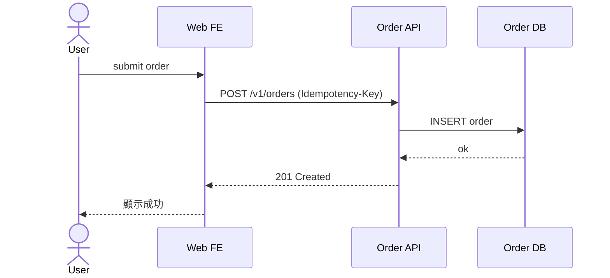
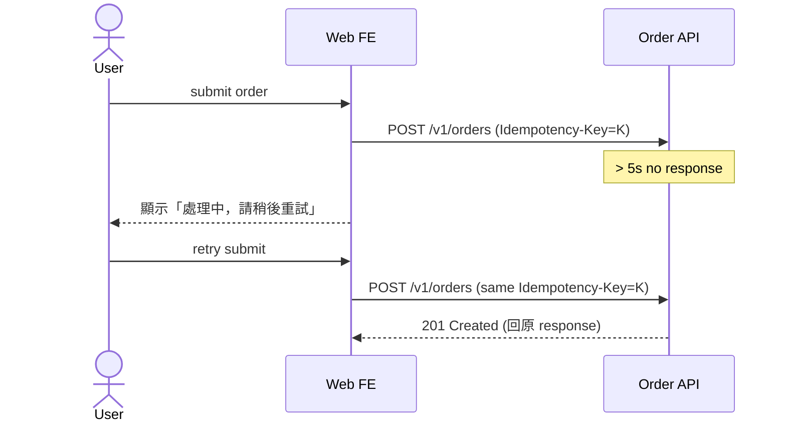
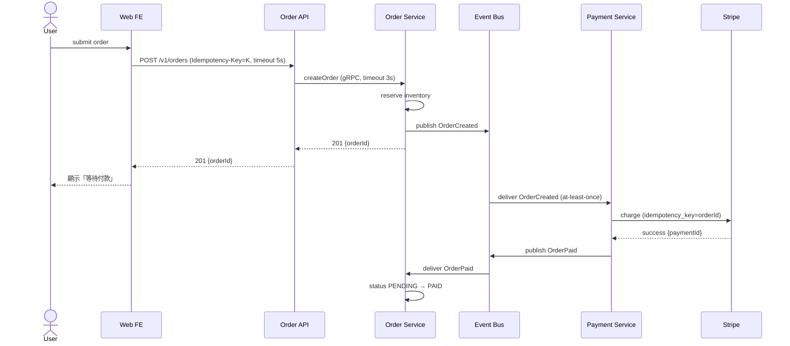
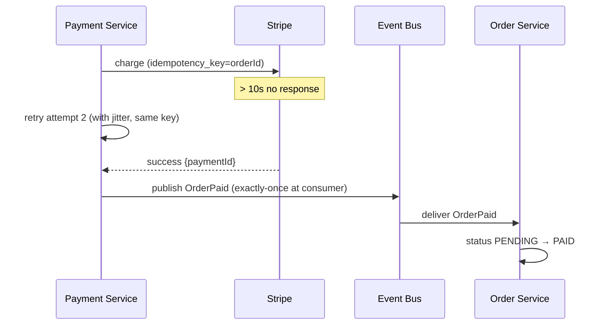
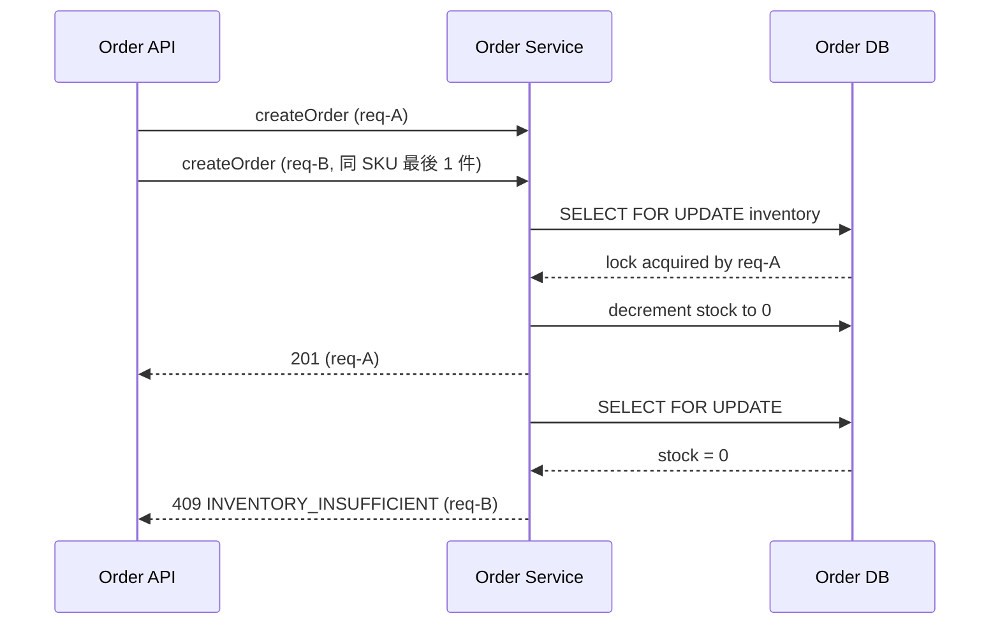

## 解決什麼問題

跨服務 flow 用文字描述「A 呼叫 B 然後 B 呼叫 C」很容易遺漏 timeout、retry、失敗回滾的細節。
Sequence Diagram 強迫把**時間順序、訊息類型、失敗路徑、補償交易**畫出來，是發現 race condition 與 idempotency 漏洞的最便宜工具。
不畫，整合測試才發現第三方失敗時 order 變孤兒、付款重複扣款。

## 誰負責、和誰對接

- **主責：** SA / Architect
- **協作：** BE（驗證實作可行）、SRE（補 failure mode）、QA（設計整合測試）
- **下游收件：** BE 實作、QA 寫 integration test、SRE 設計 alert

## 何時用、何時不用

- ✅ **必要時機：** 跨 ≥ 3 服務、有異步事件、有交易補償、外部 API 整合
- ❌ **不需要時：** 單服務內部呼叫、純 CRUD
- ⚠️ **常見誤用：** 只畫 happy path，沒畫 timeout / retry / rollback；業界實踐強調**重試不是免費的**，必須畫 backoff + jitter + idempotency

## AI 怎麼加速

把 use case（含例外流程）+ API spec + 既有 ADR 對訊息語意整份丟給 agent，讓 agent 讀範本內的 `> [!IMPORTANT]` 規則與 `<!-- ai-fill -->` 註解自己填，**人工只審 failure path 與補償交易**。本卡輸出**真實 Sequence Diagram markdown 文件**（含 Mermaid sequenceDiagram、message 表格、failure path 表格、inline `[H/M/L]` badge），**不出 YAML schema**。

## 文件範本

下面兩個 tab 是同一份契約的兩種版本，AI 讀同一份範本可雙模式輸出：**輕量範本** 給 ≤ 3 服務 / 純 sync 互動場景用（只畫 happy + 1 個關鍵 failure），**完整範本** 給 ≥ 3 服務 / 有異步事件 / saga 補償場景用（happy + ≥ 2 failure path + 補償交易）。**只畫 happy path = 沒畫**——sequence diagram 的價值就在於 failure / timeout / retry / 補償。範本內所有 `> [!IMPORTANT]` 是 AI 章節級規則、`<!-- ai-fill / ai-rule -->` 是欄位級微指引、結尾 `> [!CAUTION]` 是輸出前自檢清單。

````template-light
---
doc_type: "sequence-diagram"
variant: "light"
status: "draft"
owner: "<your-name>"
last_updated: "YYYY-MM-DD"
upstream:
  required: ["use-case", "api-spec"]
  optional: ["adr"]
---

# Sequence: <use-case-name>

**Status:** Draft · **Owner:** <SA/Architect> · **Last updated:** YYYY-MM-DD

> [!IMPORTANT]
> **AI 填寫規則：** 本範本 5 段（編號 1, 2, 3, 6, 12），全部必填——刻意沿用完整版的章節編號讓兩版可對照。每條 message 行內加 `（依據：api-spec §endpoint）`；每欄位帶 `[H]/[M]/[L]` confidence badge；缺資料寫 `_TODO: 需要 XXX_` 不編造服務；**至少畫 1 條 failure path**（純 happy path 不接受）；每條 retry 必含 backoff + max attempts + idempotency 標記。

---

## 1. Executive Summary

<!-- ai-fill: 3-5 行說明本流程涵蓋的 use case、跨幾個服務、主要 failure 點 -->

<3-5 行說明>

> **TL;DR:** <一句話：A → B → C 跨服務鏈，主要 failure 點在 X>

---

## 2. Happy Path



### Messages

| Seq | From | To | Name | Sync/Async | Idempotency | Confidence |
|---|---|---|---|---|---|---|
| 1 | User | FE | submit order | sync | n/a | **[H]** |
| 2 | FE | API | POST /v1/orders | sync | required (header) | **[H]** |
| 3 | API | DB | INSERT order | sync | n/a (FK + uniq) | **[H]** |

---

## 3. Failure Path（至少 1 條）

### Path: API timeout



- **Trigger:** API > 5s 未回
- **Compensation:** client retry with same idempotency key；server 回原 response 而非建第二筆
- **Consumer visible:** FE 顯示「處理中，請稍後重試」

---

## 6. Idempotency & Timeout（核心）

| Endpoint | Idempotency-Key | TTL | On duplicate | Client timeout |
|---|---|---|---|---|
| `POST /v1/orders` | required (UUID v4) | 24h | 回原 response | 5s |

---

## 12. Confidence & Sources & TODO

- **整份文件最低 confidence 欄位：** <列出所有 [L] 與 [M]>
- **Fabricated assumptions（推測但 input 未明說）：**
  - <假設 1：例：假設 client 會帶 Idempotency-Key>
- **Highest-value next input:** <下一份最該補的：實測 timeout 分布 / SRE alert 策略>

### TODO（缺資料）

- _TODO: 需要 SRE 確認 5s timeout 是否與 SLO 一致_

---

> [!CAUTION]
> **輸出前 AI 自檢：**
> - [ ] 5 段 H2 章節齊全（編號 1, 2, 3, 6, 12，刻意不連號）
> - [ ] Happy Path 含 mermaid sequenceDiagram
> - [ ] Failure Path 至少 1 條（純 happy 不接受）
> - [ ] 每條 POST/PATCH message 標 Idempotency-Key
> - [ ] 每個 client 呼叫標 timeout
> - [ ] 無 YAML / JSON schema 輸出（用 mermaid + 表格表達）
````

````template-full
---
doc_type: "sequence-diagram"
variant: "full"
status: "draft"
owner: "<your-name>"
last_updated: "YYYY-MM-DD"
upstream:
  required: ["use-case", "api-spec", "adr"]
  optional: ["nfr", "threat-model"]
---

# Sequence: <use-case-name>

**Status:** Draft · **Owner:** <SA/Architect> · **Last updated:** YYYY-MM-DD · **Reviewers:** BE Lead / QA / SRE

> [!IMPORTANT]
> **AI 填寫規則：** 12 段 H2 章節全部必填（任一缺失即不合格）。每條 message 行內 `（依據：api-spec §endpoint / ADR-NNN）`；每欄位 `[H/M/L]` badge；缺資料寫 `_TODO: 需要 XXX_` 不編造服務或補償邏輯；**必畫 happy + ≥ 2 條 failure path（含補償交易、timeout、partial failure 或 network partition）**；每條 retry 必含 backoff + jitter + max attempts + idempotency 標記（重試不是免費的）；禁 YAML/JSON schema 輸出。

---

## 1. Executive Summary
<!-- owner: SA · required: always -->

<!-- ai-fill: 3-5 行說明本流程涵蓋的 use case、跨幾個服務、一致性模型、最高風險 race condition -->

<3-5 行說明>

> **TL;DR:** <一句話：跨服務鏈 + 一致性模型（saga / 2PC / eventual）+ 主要 race condition>

---

## 2. Actors & Lifelines
<!-- owner: SA · required: always -->

| ID | Name | Type | Deployment / Tech | Source |
|---|---|---|---|---|
| A-User | End user | human | browser | use-case §1 |
| L-FE | Web FE | system | Next.js (browser SSR) | ADR-001 |
| L-API | Order API | system | Node.js gateway | ADR-001 |
| L-Order | Order Service | system | Go 1.22 | ADR-005 |
| L-Payment | Payment Service | system | Node.js | ADR-006 |
| L-MQ | Event Bus | external | Kafka 3.7 | ADR-007 |
| L-PaymentExt | Payment Gateway | external | Stripe | ADR-003 |

---

## 3. Happy Path
<!-- owner: SA + BE Lead · required: always -->



### Messages

| Seq | From | To | Name | Sync/Async | Protocol | Timeout | Retry | Idempotency | Confidence |
|---|---|---|---|---|---|---|---|---|---|
| 1 | User | FE | submit order | sync | DOM | n/a | none | n/a | **[H]** |
| 2 | FE | API | POST /v1/orders | sync | REST | 5s | none | required | **[H]** |
| 3 | API | Order | createOrder | sync | gRPC | 3s | none | required | **[H]** |
| 4 | Order | MQ | publish OrderCreated | async | Kafka | n/a | producer retry | event-id | **[H]** |
| 5 | MQ | Pay | deliver OrderCreated | async | Kafka consume | n/a | at-least-once | event-id | **[H]** |
| 6 | Pay | PayExt | charge | sync | HTTPS | 10s | max 3, exp+jitter | orderId | **[H]** |

---

## 4. Failure Paths
<!-- owner: SA + SRE · required: always -->

<!-- ai-rule: ≥ 2 條 failure path。每條含 trigger + compensation + consumer-visible 結果 -->

### Path A: Payment Gateway timeout



- **Trigger:** Stripe > 10s response
- **Compensation:** retry with same idempotency_key（Stripe 不會重複扣款）
- **Max attempts:** 3, exp backoff with jitter
- **If all fail:** mark order `PAYMENT_FAILED`, release inventory, publish `OrderFailed` event
- **Consumer visible:** FE poll status `/orders/{id}`, 5min 未付款顯示「付款失敗，請重試」

### Path B: Inventory oversold (concurrent submit)



- **Trigger:** 併發兩單搶最後 1 件
- **Mitigation:** SELECT FOR UPDATE serialize；或樂觀鎖 + version check
- **Consumer visible:** 後到者得 `409 INVENTORY_INSUFFICIENT`，FE 顯示「商品已售完」

---

## 5. Alt / Opt / Loop Frames
<!-- owner: SA · required: full-only -->

| Frame type | Label | Branches / messages |
|---|---|---|
| alt | payment success vs failure | success: msg 6-9 ; failure: msg 6a-9a (Path A) |
| loop | retry charge until success or max | msg 6, max 3 attempts |
| opt | post-payment notification | msg 10 (email) — failure 不阻塞主流程 |

---

## 6. Idempotency Notes
<!-- owner: BE Lead · required: always -->

| Endpoint / Event | Key source | TTL | On duplicate |
|---|---|---|---|
| `POST /v1/orders` | client UUID v4 in `Idempotency-Key` header | 24h | 回原 response（不回 409） |
| `OrderCreated` event | producer-assigned `event_id` | 7 days at consumer | consumer dedupe via event_id |
| `Stripe charge` | `orderId` as idempotency key | per Stripe TTL | Stripe 回原 charge |

---

## 7. Timeout Budget
<!-- owner: SRE + BE Lead · required: full-only -->

| Hop | Timeout | Budget so far |
|---|---|---|
| User → FE (UI feedback target) | 100ms (skeleton) | 100ms |
| FE → API | 5s | 5s |
| API → Order Service | 3s | 5s (overlap with FE→API) |
| Pay → Stripe | 10s (async, off main path) | n/a |
| **Total budget on main path** | 5s | — |
| **Exceed behavior** | FE shows "處理中"，後續用 webhook / polling 收尾 | — |

---

## 8. Race Conditions
<!-- owner: SA + BE Lead · required: full-only -->

<!-- ai-rule: 至少 3 個 race condition + 各自 mitigation -->

| # | Risk | Mitigation | Confidence |
|---|---|---|---|
| 1 | User 連點兩次 submit | FE disable on click + BE idempotency key | **[H]** |
| 2 | Inventory + Payment 跨服務雙寫 | Saga (Order → Payment → Order); 非 2PC | **[H]** |
| 3 | Webhook 順序顛倒（OrderPaid 先於 OrderCreated 抵達） | event versioning + at-least-once + idempotent consumer | **[M]** |
| 4 | Order Service 寫 DB 後 crash，未發 event | transactional outbox pattern | **[M]** |

---

## 9. Risks & Open Questions
<!-- owner: All · required: always -->

### Risks

<!-- ai-rule: 每條格式：失效模式 + Mitigation + Owner 三件齊 -->

> **R1:** <e.g. Kafka topic 順序保證僅 per-partition，OrderPaid 跨 partition 可能順序顛倒> — **Mitigation:** key by `orderId` 確保同 order 同 partition — **Owner:** <Architect>
>
> **R2:** ...

### Open Questions

- [ ] **Q1:** <例：是否需 saga orchestrator 還是 choreography？>
- [ ] **Q2:** ...

---

## 10. Decision Log
<!-- owner: Architect · required: always -->

<!-- ai-rule: 每條必含 ≥ 2 個 rejected options + 各自 rejected reason -->

| Date | Decision | Options considered | Chosen | Rejected why | Confidence |
|---|---|---|---|---|---|
| YYYY-MM-DD | 一致性模型 | sync chain / saga / 2PC | saga | sync chain (尾延遲累加)、2PC (跨 Stripe 不可行) | **[H]** |
| YYYY-MM-DD | Event delivery | at-least-once / exactly-once | at-least-once + idempotent consumer | exactly-once (broker 成本 + 跨服務無解) | **[H]** |

---

## 11. Out of Scope
<!-- owner: SA · required: full-only -->

本 Sequence Diagram **不處理**：

- ❌ **UI 內部 state machine** — 屬 UX flow / state-diagram 卡
- ❌ **Admin tool / internal ops flow** — 另張卡
- ❌ **Batch ETL / file-based 整合** — 另張時序圖
- ❌ **Refund / cancellation flow** — 另張 sequence diagram

---

## 12. Confidence & Sources & TODO
<!-- owner: All · required: always -->

- **整份文件最低 confidence 欄位：** <列出所有 [L] 與 [M] 欄位>
- **Fabricated assumptions（推測但 input 未明說的）：**
  - <假設 1：例：假設 Kafka 用 partition-key=orderId>
  - <假設 2：例：假設 client 都帶 Idempotency-Key>
- **Highest-value next input:** <下一份最該補的：實測 Stripe response time 分布 / Kafka consumer lag baseline>

### TODO（缺資料）

- _TODO: 需要實測 Stripe p99 response time 校準 10s timeout_
- _TODO: 需要 SRE 確認 Kafka consumer dedupe 視窗 7d 是否足夠_

---

> [!CAUTION]
> **輸出前 AI 自檢：**
> - [ ] 12 段 H2 章節齊全（編號 1-12）
> - [ ] Happy Path + ≥ 2 條 Failure Path（含補償交易）
> - [ ] 每條 message 標 sync/async + protocol + timeout + retry + idempotency
> - [ ] 每條 retry 含 backoff + jitter + max attempts
> - [ ] Idempotency 表涵蓋所有 POST/PATCH endpoint + event consumer
> - [ ] Timeout Budget 表示明每 hop 預算與 total
> - [ ] Race Conditions ≥ 3 個 + 各自 mitigation
> - [ ] Decision Log 每條 ≥ 2 個 rejected options + 各自 reason
> - [ ] Risks 每條格式：失效模式 + Mitigation + Owner
> - [ ] 無 YAML / JSON schema 輸出（用 mermaid + 表格表達）
````

## 怎麼觸發

先在上方 tab 選「輕量範本」或「完整範本」、按複製存到你的 AI 工作環境（web chat 對話框、Claude Code / Cursor / Aider 等 harness agent 的 context、或專案內任何 markdown 檔），再複製下面這段、把貼位區換成你的真實文件全文，給 AI：

```trigger
請依據以下「文件範本」與「上游文件」產出 Sequence Diagram markdown。嚴格遵守範本內所有 `> [!IMPORTANT]` 規則、`<!-- ai-fill -->` / `<!-- ai-rule -->` 欄位指引，並在結尾跑完 `> [!CAUTION]` 自檢清單。**只畫 happy path 等於沒畫** — 完整版必須畫 ≥ 2 條 failure path 與補償交易。

## 文件範本（貼這裡）
⏬
（貼上面選好的「輕量範本」或「完整範本」全文）
⏫

## 上游文件（貼這裡）
⏬
（貼 use-case.md / api-spec.md / 既有 ADR 對訊息語意（sync/async / at-least-once）全文）
⏫
```

> [!TIP]
> **常見錯誤：** 只畫 happy path（最常見錯誤，等於沒畫）、Retry 沒寫 backoff + jitter（容易製造 retry storm）、Idempotency 在跨服務 event 沒處理（at-least-once + 非 idempotent consumer = 重複扣款）、Timeout budget 沒列（每 hop timeout 累加超過 user 等待容忍）、race condition 假裝沒有（併發雙寫不防 = 上線炸）。AI 若漏這些，自檢清單會抓到並回頭補。
