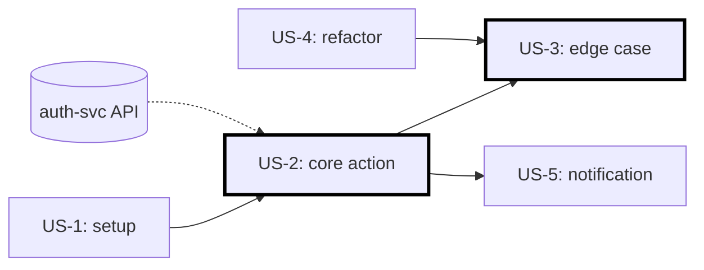

## 解決什麼問題

PRD 寫得再好，工程師也不能直接拿去寫 code——粒度太大、無法估時、無法驗收。
User Story 把 PRD 切成「一個 sprint 內可做完」的最小單位，並把「誰、為何、做什麼」寫清楚。
沒有 user story，sprint planning 變成猜謎遊戲；估時不準、驗收不清、demo 沒看點。

## 誰負責、和誰對接

- **主責：** PO（最終排序與接受度）
- **協作：** BA（補規則細節）、Dev（驗證估時）、QA（驗收條件）
- **下游收件：** Dev 寫 code、QA 寫 test case、PO 在 sprint review 驗收

## 何時用、何時不用

- ✅ **必要時機：** Sprint-based delivery、backlog ≥ 20 item、跨職能團隊
- ❌ **不需要時：** Bug fix（用 bug ticket 即可）、純技術重構（用 tech task）
- ⚠️ **常見誤用：** 寫成 "As a user, I want a button" 這種沒動機的 story；必須含 **persona + action + benefit**，並符合 INVEST（Independent, Negotiable, Valuable, Estimable, Small, Testable）

## AI 怎麼加速

把 PRD section + persona 卡 + 既有 story 命名慣例整份丟給 agent，讓 agent 讀範本內的 `> [!IMPORTANT]` 規則與 `<!-- ai-fill -->` 註解自己填，**人工只審動機是否真實、估點是否敢承諾**。本卡輸出**真實 user story markdown 文件**（含 story 卡片、INVEST checklist、依賴圖、inline `[H/M/L]` confidence badge），**不出 YAML schema**。

## 文件範本

下面兩個 tab 是同一份契約的兩種版本：**輕量範本**給單一 epic 拆解 / 3-6 個 story 一批用，**完整範本**給跨 epic backlog refinement / 多 story 含依賴圖 / sprint planning 用。範本內所有 `> [!IMPORTANT]` 是 AI 章節級規則、`<!-- ai-fill / ai-rule -->` 是欄位級微指引、結尾 `> [!CAUTION]` 是輸出前自檢清單。

```template-light
---
doc_type: "user-story"
variant: "light"
status: "draft"
owner: "<your-name>"
last_updated: "YYYY-MM-DD"
upstream:
  required: ["prd", "persona"]
  optional: ["jtbd", "story-naming-conventions"]
---

# User Stories: <epic-or-batch-name>

**Status:** Draft v0.X · **Owner:** <PO name> · **Last updated:** YYYY-MM-DD

> [!IMPORTANT]
> **AI 填寫規則：** 本範本 5 段（編號 1, 2, 3, 10, 12），全部必填——刻意沿用完整版章節編號讓兩版可對照。每個 story 必含 **persona + action + benefit 三段**；無動機 story（「As a user, I want a button」）= 直接 reject。每個 story 必通過 INVEST 6 項自檢，fail 項標 reason。Story point 用 Fibonacci，> 8 點必須建議拆分。每結論 `（依據：PRD §X / persona §Y / JTBD-NNN）`；缺資料寫 `_TODO: 需要 XXX_` 不編造。

---

## 1. Executive Summary

<!-- ai-fill: 3-5 行：本批 story 數、總點數、是否進得了當前 sprint、最高風險的 INVEST fail -->

<3-5 行說明>

> **TL;DR:** <一句話：本批多少 story、總多少點、能否一個 sprint 吃完>

---

## 2. Stories

<!-- ai-rule: 每個 story 含 statement (persona / action / benefit) + INVEST checklist + AC refs + 點數 + 依賴 -->

### US-1 · **3 pts** · **[H]**

> **As a** <persona>,
> **I want to** <action>,
> **so that** <benefit>.

- **INVEST:** Independent ✓ · Negotiable ✓ · Valuable ✓ · Estimable ✓ · Small ✓ · Testable ✓
- **Acceptance criteria refs:** AC-001, AC-002 (Given/When/Then 詳見 acceptance-criteria 卡)
- **Dependencies:** blocked_by: — · blocks: US-2 · external: —
- **Source:** PRD §FR-1 + persona §primary

### US-2 · **5 pts** · **[M]**

> **As a** <persona>,
> **I want to** <action>,
> **so that** <benefit>.

- **INVEST:** Independent ✓ · Negotiable ✓ · Valuable ✓ · Estimable ✓ · Small ⚠️ (近上限，5 pts) · Testable ✓
- **Fail reasons:** —
- **AC refs:** AC-003, AC-004, AC-005
- **Dependencies:** blocked_by: US-1 · blocks: — · external: <auth-svc API>
- **Source:** PRD §FR-2

### US-3 · **8 pts** · **[L]** · ⚠️ Consider split

> **As a** <persona>,
> **I want to** <action>,
> **so that** <benefit>.

- **INVEST:** Small ✗ — 8 pts 建議拆分為 US-3a (5 pts UI 流程) + US-3b (3 pts API 整合)
- **AC refs:** AC-006, AC-007
- **Dependencies:** ...
- **Source:** PRD §FR-3

---

## 3. Story Size & Capacity Fit

| Metric | Value |
|---|---|
| Total stories | 3 |
| Total points | 16 |
| Team velocity baseline (last 3 sprint avg) | 38 pts |
| Capacity fit | ✓ fits comfortably (< 50% capacity) |
| Suggested split | US-3 split before commit |

---

## 10. Decision Log（key 1-2 條）

<!-- ai-rule: 每條必含 chosen + 至少 1 個 rejected option + 拒絕原因 -->

| Date | Decision | Options | Chosen | Rejected why |
|---|---|---|---|---|
| YYYY-MM-DD | <例：US-A 拆兩 story 還是一個> | split / merge | split | merge (8 pts 估點不準、demo 點不清) |

---

## 12. Confidence & Sources & TODO

- **最低 confidence 項：** <列出所有 [L] 與 [M]>
- **Fabricated assumptions（推測但 input 未明說）：**
  - <假設 1，例：team velocity 38 pts 持平>
- **Highest-value next input:** <persona 訪談 / 過去 sprint velocity / UI mockup 三選一>

### TODO（缺資料）

- _TODO: 需要 UX mockup 校準 US-3 估點_

---

> [!CAUTION]
> **輸出前 AI 自檢：**
> - [ ] 5 段 H2 章節齊全（編號 1, 2, 3, 10, 12，刻意不連號）
> - [ ] 每個 story 含 persona / action / benefit 三段（無 "I want a button" 這類無動機句）
> - [ ] 每個 story 含 INVEST 6 項標記
> - [ ] 點數用 Fibonacci 1/2/3/5/8/13；> 8 必標 ⚠️ 建議拆分
> - [ ] 每個 story 含 AC refs + dependencies + source
> - [ ] Total points 對齊 team velocity baseline
> - [ ] Decision Log ≥ 1 條，每條有 rejected reason
> - [ ] 無 YAML / JSON schema 輸出（story 是給人讀的 markdown）
```

````template-full
---
doc_type: "user-story"
variant: "full"
status: "draft"
owner: "<your-name>"
last_updated: "YYYY-MM-DD"
upstream:
  required: ["prd", "persona", "jtbd"]
  optional: ["story-naming-conventions", "team-velocity-baseline", "ui-mockup"]
---

# User Stories: <epic-or-batch-name>

**Status:** Draft v0.X · **Owner:** <PO name> · **Last updated:** YYYY-MM-DD · **Reviewers:** Dev / QA / UX / Scrum Master

> [!IMPORTANT]
> **AI 填寫規則：** 12 段 H2 章節全部必填（任一缺失即不合格）。每個 story **必含 persona + action + benefit 三段**（缺任一視為 fail，禁「As a user, I want a button」這類無動機 story）；必通過 **INVEST 6 項自檢**（Independent / Negotiable / Valuable / Estimable / Small / Testable），任一 fail 標 reason；Acceptance criteria 用 Given/When/Then 格式（詳見 acceptance-criteria 卡），每 story 至少 **2 條 happy + 1 條 error path**；Story point 用 Fibonacci 1/2/3/5/8/13，> 8 點必拆分；依賴必標 blocks / blocked_by / external 三類。每結論 `（依據：PRD §X / persona §Y / JTBD-NNN）`；每量化欄位 `[H/M/L]` badge；缺資料 `_TODO: 需要 XXX_` 不編造；禁 YAML/JSON schema 輸出。

---

## 1. Executive Summary
<!-- owner: PO · required: always -->

<!-- ai-fill: 3-5 行：總 story 數、總點數、capacity fit、跨 sprint 依賴數、最高風險 INVEST fail、最高優先 story -->

<3-5 行說明>

> **TL;DR:** <一句話：本批 N 個 story / M 點，能/不能一個 sprint 吃完 + 最該先做的 story>

---

## 2. Stories
<!-- owner: PO + BA · required: always -->

<!-- ai-rule: 每個 story 含 statement + INVEST checklist + fail reasons + AC refs + size + dependencies -->

### US-1: <short-name> · **3 pts** · **[H]**

> **As a** <persona-name (對應 persona §primary)>,
> **I want to** <action>,
> **so that** <benefit (對應 JTBD-001.functional_job)>.

- **Epic:** EPIC-A
- **INVEST:**
  - Independent ✓
  - Negotiable ✓
  - Valuable ✓ (對應 OKR §KR-1)
  - Estimable ✓
  - Small ✓ (3 pts)
  - Testable ✓
- **Fail reasons:** —
- **Acceptance criteria refs:** AC-001 (happy), AC-002 (happy), AC-003 (error)
- **Story size rationale:** 對齊 team baseline「3 pts = 1 dev pair × 2-3 days」
- **Dependencies:**
  - Blocks: US-2
  - Blocked by: —
  - External: —
- **Source:** PRD §FR-1 + persona §primary + JTBD-001

### US-2: ... · **5 pts** · **[M]**

...

### US-3: ... · **8 pts** · **[L]** · ⚠️ Suggested split

> Currently 8 pts hitting Small fail. Recommend split:
> - US-3a: UI flow (5 pts)
> - US-3b: API integration (3 pts)

- **INVEST:** Small ✗ (8 pts, near upper bound; team baseline rejects > 5)
- **Fail reasons:** Small ✗ — see split suggestion
- **Acceptance criteria refs:** AC-006, AC-007, AC-008
- ...

---

## 3. Epic Groupings
<!-- owner: PO · required: full-only -->

| Epic ID | Epic name | Stories | Business value (OKR / north star) | Total points |
|---|---|---|---|---|
| EPIC-A | <例：onboarding revamp> | US-1, US-2, US-5 | OKR §KR-1 activation lift | 11 pts |
| EPIC-B | <例：churn reduction> | US-3, US-4 | OKR §KR-2 retention | 13 pts |

---

## 4. INVEST Compliance Summary
<!-- owner: PO + Dev Lead · required: full-only -->

<!-- ai-rule: 列出所有 INVEST fail 的 story + reason + 處置建議（split / re-write / remove from sprint）-->

| Story | Failed item(s) | Reason | Action |
|---|---|---|---|
| US-3 | Small | 8 pts > team baseline 5 | Split into US-3a (5 pts) + US-3b (3 pts) |
| US-7 | Independent | depends on US-5 not yet refined | Re-order: refine US-5 first |

---

## 5. Acceptance Criteria Format
<!-- owner: QA + PO · required: full-only -->

- **Format:** Given/When/Then（詳細 AC 放 acceptance-criteria 卡，本卡只列 AC-ID refs）
- **Per-story minimum:** ≥ 2 happy path + ≥ 1 error path
- **Linkage rule:** 本 batch 的 AC IDs (AC-001 ~ AC-008) 必須在 acceptance-criteria 卡有對應條目

---

## 6. Story Size & Estimation
<!-- owner: PO + Dev Lead · required: full-only -->

| Metric | Value |
|---|---|
| Total stories | 5 |
| Total points | 24 |
| Team velocity baseline (last 3 sprint avg) | 38 pts |
| Capacity utilization | 63% |
| Capacity fit | ✓ fits with buffer for incident & tech debt |
| Reference: team's "3-pt story" | <例：簡單 CRUD endpoint + unit test> |

---

## 7. Dependency Graph
<!-- owner: PO · required: full-only -->

> [!IMPORTANT]
> **AI 填寫規則：** 用 mermaid `flowchart` 視覺化 story 依賴。**External** 依賴用方形標記，**internal** 用圓角。Critical path 用粗體節點。



### Critical Path

US-1 → US-2 → US-3 (total 16 pts on critical path, gating end-of-sprint demo)

### External Dependencies

| Story | External system | Risk | Mitigation |
|---|---|---|---|
| US-2 | auth-svc API | medium | mock + integration test in week 1 |
| US-5 | notification-svc | low | already stable |

---

## 8. Sprint Planning Considerations
<!-- owner: Scrum Master + PO · required: full-only -->

| Consideration | Status |
|---|---|
| Stories estimated & < team velocity? | ✓ (24 / 38) |
| Critical path < sprint duration? | ✓ (16 pts on critical path, 2-week sprint ok) |
| External deps verified available? | ⚠️ auth-svc API mock needed by day 2 |
| All AC IDs have corresponding entries in AC card? | ⚠️ AC-008 still _TODO_ |
| Definition of Done aligned (test + docs + demo)? | ✓ |

---

## 9. Risks & Open Questions
<!-- owner: All · required: always -->

### Risks

> **R1:** <例：US-2 依賴 auth-svc API 若延遲將阻塞 critical path> — **Mitigation:** week 1 mock + 同步推進 — **Owner:** Dev Lead
>
> **R2:** ...

### Open Questions

- [ ] **Q1:** <例：US-3 拆分後 US-3a 是否仍有 demo 價值？UX 待確認>
- [ ] **Q2:** ...

---

## 10. Decision Log
<!-- owner: PO · required: always -->

<!-- ai-rule: 每條必含 ≥ 2 個 rejected options + 各自 rejected reason -->

| Date | Decision | Options considered | Chosen | Rejected why | Confidence |
|---|---|---|---|---|---|
| YYYY-MM-DD | <例：橫切 vs 縱切策略> | 橫切 UI/API/DB / 縱切完整 user flow / hybrid | 縱切 | 橫切 (沒完整 demo 點)、hybrid (story 邊界不清) | **[H]** |
| YYYY-MM-DD | <例：US-3 拆兩 story 還是一個> | split / merge / push to next sprint | split | merge (8 pts 估點不準)、push (與 KR-1 強相關) | **[M]** |

---

## 11. Out of Scope
<!-- owner: PO · required: full-only -->

本批次 **不處理**：

- ❌ **純技術 spike** — 走 tech task
- ❌ **Bug fix** — 走 bug ticket
- ❌ **跨 sprint 的 epic** — 留在 backlog refinement
- ❌ **詳細 acceptance criteria 條目** — 屬 acceptance-criteria 卡（本卡只列 AC-ID refs）
- ❌ **UI mockup** — 屬 UX 卡

---

## 12. Confidence & Sources & TODO
<!-- owner: All · required: always -->

- **整份文件最低 confidence 欄位：** <列出所有 [L] 與 [M]>
- **Fabricated assumptions（推測但 input 未明說的）：**
  - <假設 1，例：team velocity 38 pts 與上季持平>
  - <假設 2，例：US-2 auth-svc API mock 可用>
- **Highest-value next input:** <persona 訪談 / 過去 sprint velocity / UI mockup>

### TODO（缺資料）

- _TODO: 需要 UX mockup 校準 US-3 估點_
- _TODO: 需 acceptance-criteria 卡補 AC-008_

---

> [!CAUTION]
> **輸出前 AI 自檢：**
> - [ ] 12 段 H2 章節齊全（編號 1-12）
> - [ ] 每個 story 含 persona / action / benefit 三段（無「I want a button」這類無動機句）
> - [ ] 每個 story 含 INVEST 6 項標記 + fail reason
> - [ ] 點數用 Fibonacci 1/2/3/5/8/13；> 8 必標 ⚠️ 並給拆分建議
> - [ ] 每個 story 含 AC refs（指向 acceptance-criteria 卡 ID）+ dependencies + source
> - [ ] Dependency graph 用 mermaid 視覺化 + 標出 critical path
> - [ ] External 依賴標 risk + mitigation
> - [ ] Total points ≤ team velocity（含 incident & tech debt buffer）
> - [ ] Sprint planning checklist 已過
> - [ ] Decision Log 每條 ≥ 2 個 rejected options + 各自 reason
> - [ ] 無 YAML / JSON schema 輸出（story 是給人讀的 markdown）
````

## 怎麼觸發

先在上方 tab 選「輕量範本」或「完整範本」、按複製存到你的 AI 工作環境（web chat 對話框、Claude Code / Cursor / Aider 等 harness agent 的 context、或專案內任何 markdown 檔），再複製下面這段、把貼位區換成你的真實文件全文，給 AI：

```trigger
請依據以下「文件範本」與「上游文件」產出 user story markdown。嚴格遵守範本內所有 `> [!IMPORTANT]` 規則、`<!-- ai-fill -->` / `<!-- ai-rule -->` 欄位指引，並在結尾跑完 `> [!CAUTION]` 自檢清單。

## 文件範本（貼這裡）
⏬
（貼上面選好的「輕量範本」或「完整範本」全文）
⏫

## 上游文件（貼這裡）
⏬
（貼 prd.md (含 functional reqs + acceptance) / persona 卡 / JTBD / team velocity baseline 全文）
⏫
```

> [!TIP]
> **常見錯誤：** Story 寫成「As a user, I want a button, so that ...」這類無動機句（直接 reject）、INVEST 全部 ✓ 但實際 8 pts 太大（Small 灌水）、點數不用 Fibonacci 自創 4 / 6 / 7 點、依賴沒分 blocks vs blocked_by 導致 critical path 算不出、總點數超過 team velocity 卻硬塞 sprint。AI 若漏這些，自檢清單會抓到並回頭補。
