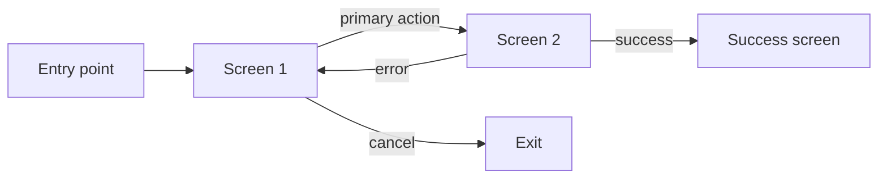

## 解決什麼問題

跳過 wireframe 直接畫高保真 UI 是常見浪費：UI 改三輪、layout 還是錯。
Wireframe 用最低成本驗證「**element 排列、資訊優先序、互動順序**」，這層對了，後續 UI 才有意義。
不畫 wireframe，stakeholder 容易爭論顏色與圖示，沒人討論底層 layout 邏輯。

## 誰負責、和誰對接

- **主責：** UX
- **協作：** PM（驗證需求對齊）、UI（接續做高保真）、FE/Mobile（評估實作可行性）
- **下游收件：** UI 畫 mockup、UX 做 usability test、Dev 估時

## 何時用、何時不用

- ✅ **必要時機：** 新功能首版、複雜表單/多步驟流程、跨平台對齊
- ❌ **不需要時：** 既有元件複用、micro-interaction 微調
- ⚠️ **常見誤用：** 把 wireframe 做太精緻（會讓 stakeholder 開始爭顏色）；應**刻意保持灰階、無細節**，聚焦 layout 與流程

## AI 怎麼加速

把 user flow + IA 整份丟給 agent，讓 agent 讀範本內 `> [!IMPORTANT]` 規則與 `<!-- ai-fill -->` 註解自己填，**人工只審 layout 邏輯與優先序判斷**。本卡輸出**真實 wireframe markdown 文件**（含 screen 表、ASCII / mermaid layout、inline `[H/M/L]` confidence badge），**不出 YAML schema**。

## 文件範本

下面兩個 tab 是同一份 wireframe 契約的兩種版本：**輕量範本** 給 ≤ 5 個 screen、小功能 / MVP 用，**完整範本** 給 ≥ 5 個 screen、跨平台一致性、複雜分支流程的情境用。範本內所有 `> [!IMPORTANT]` 是 AI 章節級規則、`<!-- ai-fill / ai-rule -->` 是欄位級微指引、結尾 `> [!CAUTION]` 是輸出前自檢清單。

````template-light
---
doc_type: "wireframe"
variant: "light"
status: "draft"
owner: "<your-name>"
last_updated: "YYYY-MM-DD"
upstream:
  required: ["user-flow", "information-architecture"]
  optional: ["prd"]
---

# Wireframe: <product-name>

**Status:** Draft v0.X · **Owner:** <UX name> · **Last updated:** YYYY-MM-DD

> [!IMPORTANT]
> **AI 填寫規則：** 本範本 6 段（編號 1, 2, 3, 6, 10, 12），全部必填——刻意沿用完整版章節編號讓兩版可對照。每 screen 必含 `purpose + key_elements + states_covered`；fidelity 必為 low / mid（不出 high）；每分類行內加 `（依據：user-flow §XXX / IA §YYY）`；每量化欄位加 `[H]/[M]/[L]` badge；缺資料寫 `_TODO: 需要 XXX_` 不編造（不要自行決定品牌色或文案）。

---

## 1. Executive Summary

<!-- ai-fill: 3-5 行：涵蓋 N 個 screen、主要 flow、選用 fidelity 等級與 rationale -->

<3-5 行說明>

> **TL;DR:** <一句話：使用者進入產品到完成核心任務的 layout 骨架>

---

## 2. Screens

<!-- ai-rule: 至少 3 個 screen；每個含 purpose + key_elements + reading_pattern + states_covered -->

### S1: <screen 名稱>

- **Purpose:** <一句話說此 screen 解決什麼>
- **Key elements:** header / primary_action / content_blocks / secondary_action / footer
- **Reading pattern:** F / Z / center / list
- **States covered:** default, empty, loading, error
- **Confidence:** **[H]** — **Source:** user-flow §1

### S2: ...

---

## 3. Content Priorities

<!-- ai-rule: 每個 screen 列 primary / secondary / tertiary 三個元素 + 為何此優先序 -->

| Screen | Element | Priority | Rationale | Confidence |
|---|---|---|---|---|
| S1 | <例：CTA「開始試用」> | primary | <引用 user goal> | **[H]** |
| S1 | <secondary 元素> | secondary | ... | **[M]** |

---

## 6. Breakpoints & Fidelity

<!-- ai-rule: 至少含 mobile_360 + desktop_1280；fidelity 必為 low / mid -->

| Breakpoint | Layout |
|---|---|
| mobile_360 | <stack / 1-col 描述> |
| desktop_1280 | <multi-col 描述> |

- **Fidelity level:** low / mid（**不出 high**）
- **Rationale:** 刻意保持灰階、避免過早討論視覺

---

## 10. Decision Log（key 2-3 條）

<!-- ai-rule: 每條必含 chosen + 至少 1 個 rejected + 拒絕原因 -->

| Date | Decision | Options | Chosen | Rejected why | Confidence |
|---|---|---|---|---|---|
| YYYY-MM-DD | 主導航用什麼 | top-tab / side-nav / hamburger | top-tab | side-nav (mobile 不友善)、hamburger (隱藏功能) | **[H]** |

---

## 12. Confidence & Sources & TODO

- **整份文件最低 confidence 欄位：** <列出所有 [L] 與 [M]>
- **Fabricated assumptions：**
  - <例：假設使用者已登入>
- **Highest-value next input:** <例：實際斷點分析 / mobile gesture 限制>

### TODO（缺資料）

- _TODO: 需要 UI / Brand 提供文案 owner_

---

> [!CAUTION]
> **輸出前 AI 自檢：**
> - [ ] 6 段 H2 章節齊全（編號 1, 2, 3, 6, 10, 12）
> - [ ] 每個 screen 帶 `[H/M/L]` badge + 行內 `（依據：...）`
> - [ ] Fidelity 為 low / mid（**沒寫 high**）
> - [ ] States covered ≥ 4（default / empty / loading / error）
> - [ ] Decision Log ≥ 1 條，每條有 rejected reason
> - [ ] 沒有編造品牌色 / 最終文案
> - [ ] 無 YAML / JSON schema 輸出（wireframe 是給人讀的 markdown）
````

````template-full
---
doc_type: "wireframe"
variant: "full"
status: "draft"
owner: "<your-name>"
last_updated: "YYYY-MM-DD"
upstream:
  required: ["user-flow", "information-architecture", "prd"]
  optional: ["competitive-scan", "device-analytics"]
---

# Wireframe: <product-name>

**Status:** Draft v0.X · **Owner:** <UX name> · **Last updated:** YYYY-MM-DD · **Reviewers:** UI / PM / FE / Mobile

> [!IMPORTANT]
> **AI 填寫規則：** 12 段 H2 章節全部必填（任一缺失即不合格）。每 screen 必含 `purpose + key_elements + reading_pattern + states_covered ≥ 4`；fidelity 必為 low / mid（不出 high）；行內 `（依據：user-flow §XXX / IA §YYY / PRD §ZZ）`；每量化欄位 `[H/M/L]` badge；缺資料 `_TODO: 需要 XXX_` 不編造（不要自行決定品牌色或文案）；a11y baseline（reading order / touch target / 不只用色）必含；禁 YAML/JSON schema 輸出。

---

## 1. Executive Summary
<!-- owner: UX · required: always -->

<!-- ai-fill: 3-5 行：N screen、主要 flow、fidelity 選擇與 rationale、預期下游 UI / FE 使用方式 -->

<3-5 行說明>

> **TL;DR:** <一句話：使用者進產品到完成核心任務的 layout 骨架>

---

## 2. Screens
<!-- owner: UX · required: always -->

<!-- ai-rule: 每個 screen 含 purpose + key_elements + reading_pattern + states_covered。States 至少 4 種（default / empty / loading / error） -->

### S1: <screen 名稱>

- **Purpose:** <一句話說此 screen 解決什麼>
- **Key elements:** header / primary_action / content_blocks / secondary_action / footer
- **Reading pattern:** F / Z / center / list
- **States covered:** default, empty, loading, error, disabled
- **Confidence:** **[H]** — **Source:** user-flow §1 + IA §C1

### S2: <screen 名稱>

...

---

## 3. Content Priorities
<!-- owner: UX + PM · required: always -->

<!-- ai-rule: 每 screen 列 primary / secondary / tertiary 三個元素；rationale 引用 user goal 或 JTBD -->

| Screen | Element | Priority | Rationale | Confidence |
|---|---|---|---|---|
| S1 | <例：CTA「開始試用」> | primary | <引用 user goal / JTBD-001> | **[H]** |
| S1 | <secondary 元素> | secondary | ... | **[M]** |
| S2 | ... | tertiary | ... | **[M]** |

---

## 4. User Flow Link
<!-- owner: UX · required: full-only -->

> [!IMPORTANT]
> **AI 填寫規則：** 用 mermaid `flowchart LR` 畫 screen 間的轉場；節點 = screen ID，邊 = 使用者動作。若上游 user-flow 存在，必須對齊；不存在時依 JTBD 推導並標 `_推導自 JTBD-XXX_`。



- **Entry points:** <from where, e.g. push notification / home>
- **Exit points:** <to where>
- **Branches:** <條件分支描述>

---

## 5. Gestures & Input
<!-- owner: UX + Mobile · required: full-only · skippable: 純 web 可降為「鍵盤 + click」單行 -->

<!-- ai-rule: primary / secondary input + keyboard support -->

- **Primary input:** tap / click / swipe / keyboard
- **Secondary input:** long press / scroll / hover
- **Keyboard support:** tab order required（a11y 必要）

---

## 6. Breakpoints & Fidelity
<!-- owner: UX + FE · required: always -->

<!-- ai-rule: 至少含 mobile_360 + desktop_1280；複雜產品建議再加 tablet_768；fidelity 必為 low / mid -->

| Breakpoint | Layout |
|---|---|
| mobile_360 | <stack / 1-col 描述> |
| tablet_768 | <2-col / sidebar 描述> |
| desktop_1280 | <multi-col 描述> |

- **Fidelity level:** low / mid（**不出 high**）
- **Rationale:** <為何此 fidelity——避免過早討論視覺，聚焦結構>

---

## 7. A11y Baseline
<!-- owner: UX · required: full-only -->

<!-- ai-rule: 3 項全填（reading order / touch target / 不只用色）；任一不適用須寫 rationale -->

| Dimension | Target | Rationale |
|---|---|---|
| **Reading order** | 邏輯一致（h1 → h2 → content） | <如何驗證> |
| **Touch target** | ≥ 44×44 px | <對應斷點> |
| **Color not sole indicator** | 用尺寸 / 位置 / icon 同步傳達 | <為何> |

---

## 8. Assumptions
<!-- owner: UX · required: full-only -->

<!-- ai-rule: 列出本 wireframe 預設但未驗證的條件 -->

- <例：假設使用者已登入>
- <例：假設 i18n 字串長度差異 ≤ 30%>
- <例：假設裝置最低為 mobile_360>

---

## 9. Risks & Open Questions
<!-- owner: All · required: always -->

### Risks

> **R1:** <例：S2 表單欄位過多，mobile 滾動易迷失> — **Mitigation:** 拆分多步驟 / 加 progress bar — **Owner:** <name>
>
> **R2:** ...

### Open Questions

- [ ] **Q1:** <例：登入後直接進 S1 還是 onboarding？>

---

## 10. Decision Log
<!-- owner: UX · required: always -->

<!-- ai-rule: 每條必含 ≥ 2 個 rejected options + 各自 rejected reason -->

| Date | Decision | Options considered | Chosen | Rejected why | Confidence |
|---|---|---|---|---|---|
| YYYY-MM-DD | 主導航用什麼 | top-tab / side-nav / hamburger | top-tab | side-nav (mobile 不友善)、hamburger (隱藏功能) | **[H]** |

---

## 11. Out of Scope
<!-- owner: UX · required: full-only -->

本 wireframe 文件 **不處理**：

- ❌ **不做視覺風格 / 品牌色** — 屬 design-system / hi-fi mockup
- ❌ **不寫 micro-copy 最終文案** — 屬 內容團隊 / UX writing
- ❌ **不做動畫 / motion spec** — 屬 hi-fi mockup / prototype
- ❌ **不做 component API 定義** — 屬 design-system

---

## 12. Confidence & Sources & TODO
<!-- owner: All · required: always -->

- **整份文件最低 confidence 欄位：** <列出所有 [L] 與 [M] 欄位>
- **Fabricated assumptions：**
  - <假設 1>
  - <假設 2>
- **Highest-value next input:** <實際斷點分析 / mobile gesture 限制 / usability test>

### TODO（缺資料）

- _TODO: 需要 UI / Brand 提供文案 owner_
- _TODO: 補 tablet 斷點 layout_

---

> [!CAUTION]
> **輸出前 AI 自檢：**
> - [ ] 12 段 H2 章節齊全（編號 1-12）
> - [ ] 每個 screen 帶 `[H/M/L]` badge + 行內 `（依據：...）`
> - [ ] States covered ≥ 4（含 default / empty / loading / error）
> - [ ] User Flow Link 段含 mermaid（或標 `_推導自 JTBD_`）
> - [ ] Fidelity 為 low / mid（**沒寫 high**）
> - [ ] A11y baseline 3 項全填（reading order / touch target / 不只用色）
> - [ ] Decision Log 每條 ≥ 2 個 rejected options + 各自 reason
> - [ ] 沒有編造品牌色 / 最終文案
> - [ ] 無 YAML / JSON schema 輸出（wireframe 是給人讀的 markdown）
````

## 怎麼觸發

先在上方 tab 選「輕量範本」或「完整範本」、按複製存到你的 AI 工作環境（web chat 對話框、Claude Code / Cursor / Aider 等 harness agent 的 context、或專案內任何 markdown 檔），再複製下面這段、把貼位區換成你的真實文件全文，給 AI：

```trigger
請依據以下「文件範本」與「上游文件」產出 wireframe markdown。嚴格遵守範本內所有 `> [!IMPORTANT]` 規則、`<!-- ai-fill -->` / `<!-- ai-rule -->` 欄位指引，並在結尾跑完 `> [!CAUTION]` 自檢清單。

## 文件範本（貼這裡）
⏬
（貼上面選好的「輕量範本」或「完整範本」全文）
⏫

## 上游文件（貼這裡）
⏬
（貼 user-flow / IA / PRD 全文）
⏫
```

> [!TIP]
> **常見錯誤：** wireframe 做太精緻變成在討論顏色（fidelity 必須 low / mid）、漏 empty / error state（只畫 happy path）、自行編造品牌色或文案（應留 TODO 給內容團隊）、Decision Log 只列 chosen 不列 rejected（= 黑箱）、touch target < 44×44 沒寫 rationale。AI 若漏這些，自檢清單會抓到並回頭補。
